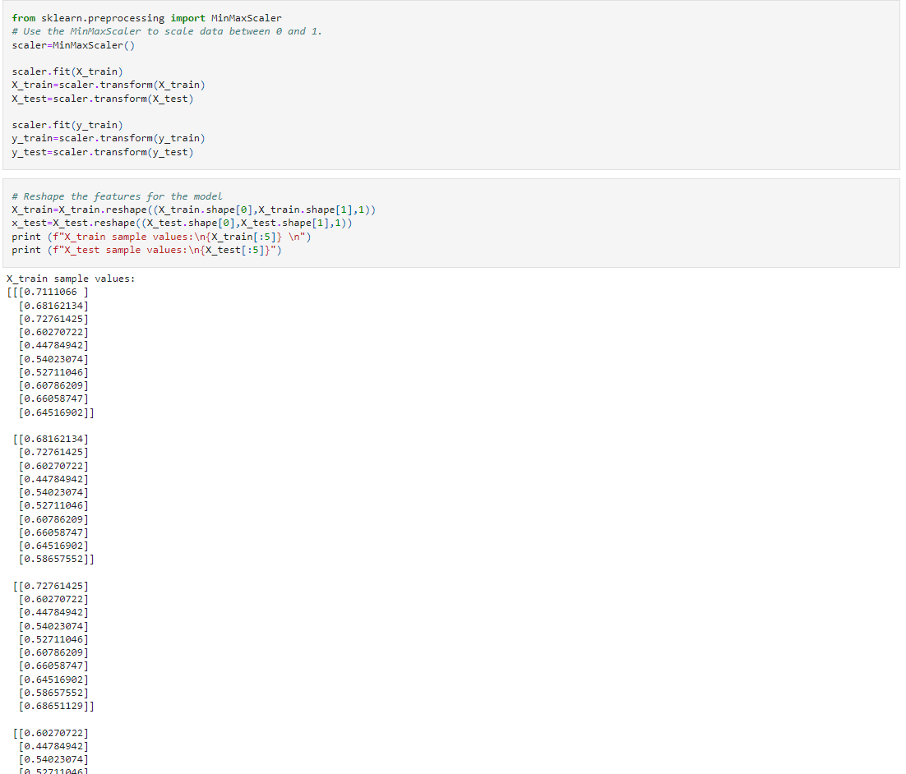
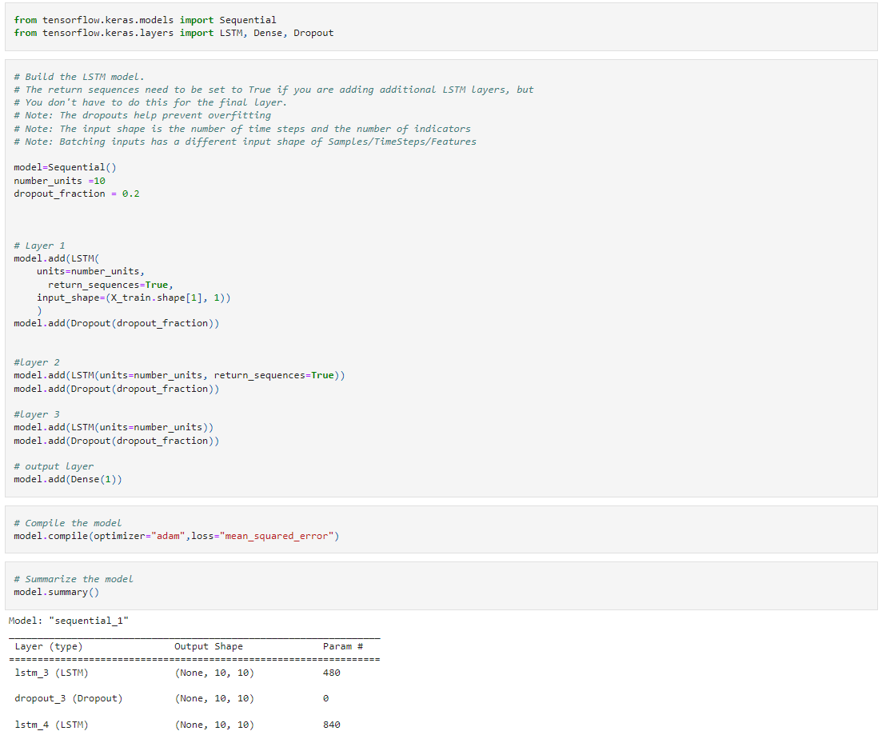
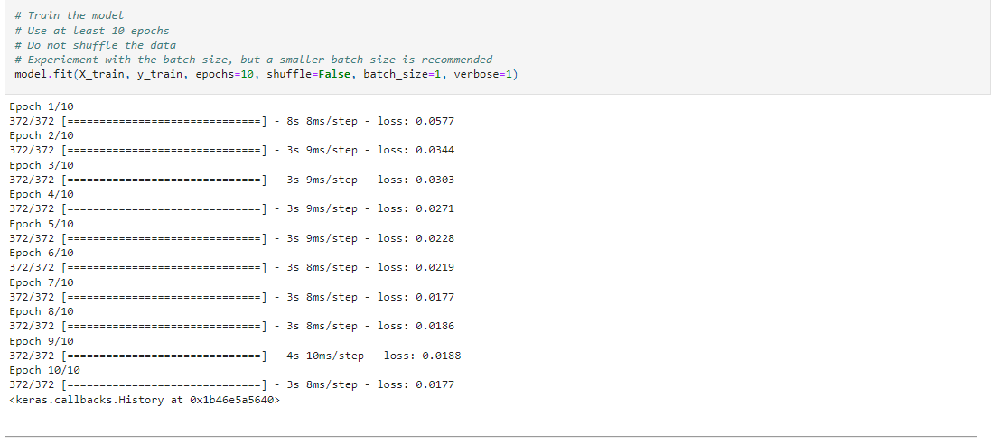

# LSTM-Stock-Predictor-

## by Nedal Mahanweh 

In this assignment, we will use deep learning recurrent neural networks to model bitcoin closing prices. One model will use the FNG indicators to predict the closing price while the second model will use a window of closing prices to predict the nth closing price

### Main tasks
1. [Prepare the data for training and testing](#prepare-the-data-for-training-and-testing)
2. [Build and train custom LSTM RNNs](#build-and-train-custom-lstm-rnns)
3. [Evaluate the performance of each model](#evaluate-the-performance-of-each-model)

- - -
### Files

[Resources](Resources)

[Images](images)

[Closing Prices Starter Notebook](lstm_stock_predictor_closing.ipynb)

[FNG Starter Notebook](lstm_stock_predictor_fng.ipynb)

- - -

## LSTM Stock Predictor Using Closing Prices

### Prepare the data for training and testing

Apply a MinMaxScaler to the X and y values to scale the data for the model
& Reshape the features for the model

### Build and train custom LSTM RNNs

In this section, we will design a custom LSTM RNN and fit (train) it using the training data.

we will need to:

1-Define the model architecture

2-Compile the model

3-Fit the model to the training data
 - - -

### Evaluate the performance of each model

in this section, we will evaluate the model using the test data.

we will need to:

1-Evaluate the model using the X_test and y_test data.

2-Use the X_test data to make predictions

3-Create a DataFrame of Real (y_test) vs predicted values.

4-Plot the Real vs predicted values as a line chart

- - -  

## LSTM Stock Predictor Using Fear and Greed Index

### Data Preparation

## Build and Train the LSTM RNN

In this section, we will design a custom LSTM RNN and fit (train) it using the training data.

we will need to:

1-Define the model architecture

2-Compile the model

3-Fit the model to the training data

## Model Performance

In this section, we will evaluate the model using the test data.

we  will need to:

1-Evaluate the model using the X_test and y_test data.

2- Use the X_test data to make predictions
3- Create a DataFrame of Real (y_test) vs predicted values.
4- Plot the Real vs predicted values as a line chart

_ _ _